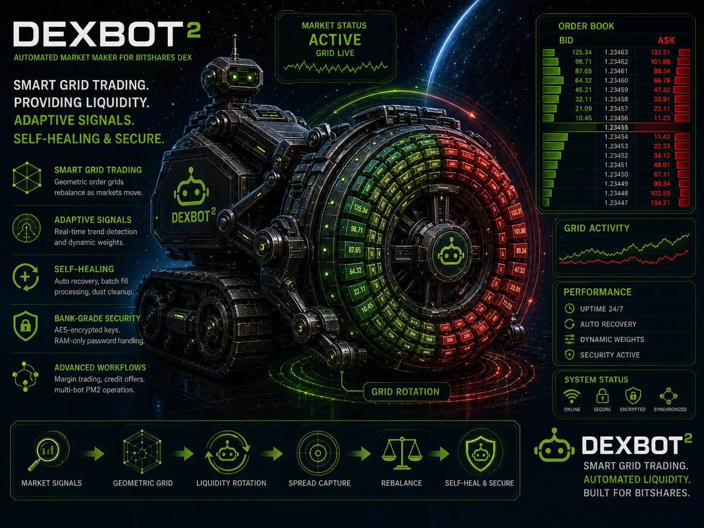

# DEXBot2

DEXBot2 is a grid-based market maker for the BitShares decentralized exchange.

<p align="center">
  
</p>

## 🚀 Features

- **Grid Trading** — geometric order grids that rebalance as price moves
- **Adaptive Signals** — AMA and trend inputs tune grid placement
- **Credit & MPA** — credit offer and debt workflows
- **Runtime Safety** — replay-safe fills, sync recovery, and cleanup
- **Secure Ops** — encrypted keys, a credential daemon, and PM2 control

## 🔥 Quick Start

```bash
# 1. Clone and install
git clone https://github.com/froooze/DEXBot2.git && cd DEXBot2 && npm install

# 2. Set up your master password, keys and add bots
node dexbot keys
node dexbot bots

# 3. Start with PM2 or directly
node pm2           # For production
node pm2 claw-only  # PM2-managed credential daemon only
node unlock-start  # Single prompt, no PM2
node unlock-start --claw-only  # Credential daemon only for claw workflows
node dexbot start  # For testing
```

For detailed setup, see [Installation](#installation) or [Updating](#updating-dexbot2) sections below.

### Disclaimer — Use At Your Own Risk

- This software is provided "as-is" without warranty.
- Secure your keys. Never share private keys or passwords.
- The authors and maintainers are not responsible for losses.

## 📥 Installation

### Prerequisites

You'll need **Git** and **Node.js** installed.

#### Windows Users

1. Install **Node.js LTS** from [nodejs.org](https://nodejs.org/) (accept defaults, restart after)
2. Install **Git** from [git-scm.com](https://git-scm.com/) (accept defaults, restart after)
3. Verify installation in Command Prompt:
   ```bash
   node --version && npm --version && git --version
   ```
   All three should display version numbers.

#### macOS Users

Use Homebrew to install Node.js and Git:
```bash
# Install Homebrew if not already installed
/bin/bash -c "$(curl -fsSL https://raw.githubusercontent.com/Homebrew/install/HEAD/install.sh)"

# Install Node.js and Git
brew install node git
```

#### Linux Users

Use your package manager:
```bash
# Ubuntu/Debian
sudo apt-get update
sudo apt-get install nodejs npm git

# Fedora/RHEL
sudo dnf install nodejs npm git
```

### Clone and Setup DEXBot2

```bash
# Clone the repository and switch to folder
git clone https://github.com/froooze/DEXBot2.git
cd DEXBot2

# Install dependencies
npm install

# Set up your master password and keyring
node dexbot keys

# Create and configure your bots
node dexbot bots
```

### Updating DEXBot2

Update to the latest version:

```bash
# Run the update script from project root
node dexbot update
```

The update script automatically:
- Fetches and pulls the latest code
- Installs any new dependencies
- Reloads active PM2 bot processes if running
- Ensures your `profiles/` directory is protected and unchanged
- Logs all operations to `update.log`

## 🔧 Configuration

### Recommended Bot Setup

Keep the generated defaults and tune only these first:

1. `targetSpreadPercent`
2. `incrementPercent`
3. `gridPrice: "ama"`
4. `minPrice` / `maxPrice`

`targetSpreadPercent` controls profit room per completed cycle. A wider spread
targets more profit per cycle but trades less often.

`incrementPercent` controls grid density and order size. Smaller increments
create more grid levels and smaller orders; larger increments create fewer
levels and larger orders.

Use `gridPrice: "ama"` so the market adapter can center the grid on AMA. Once
AMA is active, tighten `minPrice` / `maxPrice` around the maximum expected
market volatility instead of using an unnecessarily wide range.

### Simple AMA Workflow

1. Create the bot with `node dexbot bots`.
2. Leave defaults unchanged.
3. Tune `targetSpreadPercent` and `incrementPercent`.
4. Set `gridPrice` to `ama`.
5. Generate the market-adapter whitelist:

   ```bash
   npm run market-adapter:whitelist
   ```

6. Start DEXBot2 normally with `node pm2` or `node unlock-start`.
7. Then tune `minPrice` / `maxPrice` for the market's volatility range.

### Bot Options Reference

Configuration options from `node dexbot bots`, stored in `profiles/bots.json`:

| Parameter | Type | Description |
| :--- | :--- | :--- |
| **`assetA`** | string | Base asset |
| **`assetB`** | string | Quote asset |
| **`name`** | string | Friendly name for logging and CLI selection |
| **`active`** | boolean | `false` to keep config without running |
| **`dryRun`** | boolean | Simulate orders without broadcasting |
| **`preferredAccount`** | string | BitShares account name for trading |
| **`startPrice`** | num \| str | Initial price and adapter candle source. Default `"pool"` uses liquidity-pool history; `"book"` uses order-book history; a number uses a fixed anchor. |
| **`minPrice`** | num \| str | Lower bound. Default `"2x"` means `gridPrice / 2` when AMA is active, otherwise `startPrice / 2`. |
| **`maxPrice`** | num \| str | Upper bound. Default `"2x"` means `gridPrice * 2` when AMA is active, otherwise `startPrice * 2`. |
| **`gridPrice`** | num \| str \| null | Grid reference. Use `"ama"` for the recommended AMA center; `null` falls back to `startPrice`; numeric values use that fixed value. |
| **`incrementPercent`** | number | Geometric step between layers. Default `0.5` = 0.5%. |
| **`targetSpreadPercent`** | number | Width of the empty spread zone between buy and sell orders. Default `2` = 2%. |
| **`weightDistribution`** | object | Advanced sizing control. Default `{ "sell": 1.0, "buy": 1.0 }`; leave unchanged for normal setup. |
| **`botFunds`** | object | Capital: `{ "sell": "100%", "buy": 1000 }`. Numbers or percentage strings |
| **`activeOrders`** | object | Max concurrent orders per side: `{ "sell": 5, "buy": 5 }` |

### General Options (Global)

Global settings via `node dexbot bots`, stored in `profiles/general.settings.json`:

- **Grid Health**: Grid Cache Regeneration % (default `3%`), RMS Divergence Threshold % (default `14.3%`), AMA Delta Threshold % (default `2%`)
- **Order Recovery**: Partial Dust Threshold % (default `5%`), Dust Cancel Delay (default `30s`, `-1` = off, `0` = instant)
- **Timing (Core)**: Blockchain Fetch Interval (default `240 min`), Sync Delay (default `500ms`), Lock Timeout (default `10s`)
- **Timing (Fill)**: Dedupe Window (default `5s`), Cleanup Interval (default `10s`), Record Retention (default `60 min`)
- **Log Level**: `debug`, `info`, `warn`, `error`. Fine-grained category control via `LOGGING_CONFIG` (see [Logging](docs/LOGGING.md))
- **Updater**: Active (default `ON`), Branch (`auto`/`main`/`dev`/`test`), Interval (default `1 day`), Time (default `00:00`)

## 🎯 PM2 Process Management

For production use with automatic restart and monitoring. Run `node pm2` to start — it handles connection, authentication, and PM2 startup automatically.

```bash
# Start all active bots with PM2
node pm2

# Start a specific bot
node pm2 <bot-name>

# Start only the credential daemon
node pm2 claw-only

# Or via CLI
node dexbot pm2

# View status and resource usage
pm2 status

# View real-time logs
pm2 logs [<bot-name>]

# Safe restart/reload path for DEXBot-managed PM2 apps
node pm2 restart {all|<bot-name>|dexbot-cred}
node pm2 reload {all|<bot-name>|dexbot-cred}

# Stop processes
pm2 stop {all|<bot-name>}

# Delete processes
pm2 delete {all|<bot-name>}

# Stop/delete only dexbot processes (via wrapper)
node pm2 stop {all|<bot-name>}
node pm2 delete {all|<bot-name>}

# Reset grid (regenerate orders)
node dexbot reset {all|<bot-name>}

# Disable a bot in config
node dexbot disable {all|<bot-name>}

# Show PM2 wrapper usage
node pm2 help
```

Bot logs are written to `profiles/logs/<bot-name>.log` (errors to `<bot-name>-error.log`).

Security note: `node pm2` now unlocks `dexbot-cred` through a one-shot local bootstrap channel instead of exporting the master password to every PM2 app. Use `node pm2 restart ...` or `node pm2 reload ...` for DEXBot-managed PM2 actions. Avoid raw `pm2 restart all` / `pm2 reload all`, because `dexbot-cred` must only be re-unlocked through the wrapper. If `dexbot-cred` stops, rerun `node pm2` or `node pm2 restart dexbot-cred`.

## 📚 Documentation

### User-Facing Workflows

- **[Market Adapter README](market_adapter/README.md)** - AMA pricing, grid triggers, dynamic weights, and collateral advisory signals
- **[MPA and Credit Usage](docs/MPA_CREDIT_USAGE.md)** - Bot-scoped debt policy, MPA borrowing, and credit offer workflows
- **[Claw README](claw/README.md)** - Bridge setup, launcher commands, short MPA workflow, and example commands
- **[Analysis](analysis/README.md)** - Research runners, chart generators, and tuning helpers for AMA fitting, trend detection, bot fitting, and TradingView exports

### Operational & Security

- **[Credential Security](docs/CREDENTIAL_SECURITY.md)** - Key handling, daemon-backed signing, and runtime file hardening
- **[Grid Recalculation](docs/GRID_RECALCULATION.md)** - Market-adapter bootstrap/delta/slope resets, divergence correction, fund regeneration, and runtime trigger handling
- **[Logging](docs/LOGGING.md)** - Logging system documentation
- **[Docker](docs/docker.md)** - Container build, release images, and secure startup

### Reference Docs

- **[Docs Index](docs/README.md)** - Main documentation hub
- **[Claw API Boundary](claw/docs/AI_BOT_LIBRARY_API.md)** - Responsibility split between the AI layer and the DEXBot2 execution layer
- **[Architecture](docs/architecture.md)** - System design, fill processing pipeline, and testing strategy
- **[Developer Guide](docs/developer_guide.md)** - Development guide, environment variables, examples, and glossary
- **[Copy-on-Write Plan](docs/COPY_ON_WRITE_MASTER_PLAN.md)** - Copy-on-Write grid architecture
- **[Fund Movement & Accounting](docs/FUND_MOVEMENT_AND_ACCOUNTING.md)** - Fund accounting, grid topology, and rotation mechanics
- **[Evolution Report](docs/EVOLUTION.md)** - Project timeline, architecture phases, and release history
- **[Workflow](docs/WORKFLOW.md)** - Project workflow and contribution guide

## 🤝 Contributing

1. Fork the repository and create a feature branch
2. Make your changes and test with `npm test`
3. Submit a pull request

## 📄 License

MIT License - see LICENSE file for details

## 🔗 Links

- [](https://t.me/DEXBot_2)
- [](https://dexbot.org/)
- [](https://deepwiki.com/froooze/DEXBot2)
- [](https://github.com/bitshares/awesome-bitshares)
- [](https://www.reddit.com/r/BitShares/)
