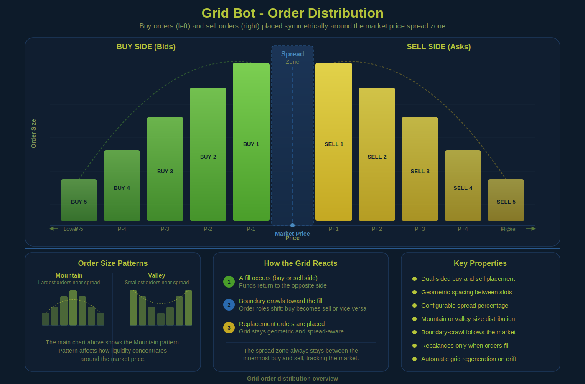

# DEXBot2

DEXBot2 is an automated market maker for the BitShares decentralized exchange.



## 🚀 Features

- **Geometric Grid Trading** — fund-driven recalculation with configurable weight distribution
- **Constant Spread** — fixed bid-ask gap that adapts to market movement
- **Copy-on-Write Grid** — transactional rebalancing on isolated working copies ([details](docs/COPY_ON_WRITE_MASTER_PLAN.md))
- **Adaptive Fill Batching** — 1-4 fills per broadcast, ~24s for 29 fills
- **Self-Healing Recovery** — periodic retries with automatic state reset
- **Dust Auto-Cancellation** — configurable delay before cancelling small remainders on-chain
- **Boundary-Crawl Rebalancing** — periodic grid regeneration and fund invariant verification
- **AES-Encrypted Key Storage** — RAM-only password handling
- **PM2 Integration** — multi-bot management with auto-updates and monitoring
- **Claw Integration Layer** — bridge exposing BitShares capabilities and DEXBot2 infrastructure to external runtimes ([details](claw/README.md))

## 🔥 Quick Start

```bash
# 1. Clone and install
git clone https://github.com/froooze/DEXBot2.git && cd DEXBot2 && npm install

# 2. Set up your master password, keys and add bots
node dexbot keys
node dexbot bots

# 3. Start with PM2 or directly
node pm2           # For production
node unlock-start.js  # Single prompt, no PM2
node dexbot start  # For testing
```

For detailed setup, see [Installation](#installation) or [Updating](#updating-dexbot2) sections below.

### Disclaimer — Use At Your Own Risk

- This software is provided "as-is" without warranty.
- Secure your keys. Never share private keys or passwords.
- The authors and maintainers are not responsible for losses.

## 📥 Installation

### Prerequisites

You'll need **Git** and **Node.js** installed.

#### Windows Users

1. Install **Node.js LTS** from [nodejs.org](https://nodejs.org/) (accept defaults, restart after)
2. Install **Git** from [git-scm.com](https://git-scm.com/) (accept defaults, restart after)
3. Verify installation in Command Prompt:
   ```bash
   node --version && npm --version && git --version
   ```
   All three should display version numbers.

#### macOS Users

Use Homebrew to install Node.js and Git:
```bash
# Install Homebrew if not already installed
/bin/bash -c "$(curl -fsSL https://raw.githubusercontent.com/Homebrew/install/HEAD/install.sh)"

# Install Node.js and Git
brew install node git
```

#### Linux Users

Use your package manager:
```bash
# Ubuntu/Debian
sudo apt-get update
sudo apt-get install nodejs npm git

# Fedora/RHEL
sudo dnf install nodejs npm git
```

### Clone and Setup DEXBot2

```bash
# Clone the repository and switch to folder
git clone https://github.com/froooze/DEXBot2.git
cd DEXBot2

# Install dependencies
npm install

# Set up your master password and keyring
node dexbot keys

# Create and configure your bots
node dexbot bots
```

### Updating DEXBot2

Update to the latest version:

```bash
# Run the update script from project root
node dexbot update
```

The update script automatically:
- Fetches and pulls the latest code
- Installs any new dependencies
- Reloads PM2 processes if running
- Ensures your `profiles/` directory is protected and unchanged
- Logs all operations to `update.log`

## 🔧 Configuration

### Bot Options

Configuration options from `node dexbot bots`, stored in `profiles/bots.json`:

| Parameter | Type | Description |
| :--- | :--- | :--- |
| **`assetA`** | string | Base asset |
| **`assetB`** | string | Quote asset |
| **`name`** | string | Friendly name for logging and CLI selection |
| **`active`** | boolean | `false` to keep config without running |
| **`dryRun`** | boolean | Simulate orders without broadcasting |
| **`preferredAccount`** | string | BitShares account name for trading |
| **`startPrice`** | num \| str | Initial price. `"pool"` (liquidity pool), `"market"` (order book), or numeric `A/B` ratio |
| **`minPrice`** | num \| str | Lower bound. Number or multiplier (e.g., `"2x"` = `startPrice / 2`) |
| **`maxPrice`** | num \| str | Upper bound. Number or multiplier (e.g., `"2x"` = `startPrice * 2`) |
| **`gridPrice`** | num \| str \| null | Reference price for bound calculations. `null` (uses `startPrice`), numeric, or AMA keyword (`"ama"`, `"ama1"`-`"ama4"`) |
| **`gridPriceOffsetPct`** | number | Signed offset applied to the AMA center price (`-10` to `+10`%). `price = ama × (1 + offset/100)`. Set to `0` to disable the offset |
| **`incrementPercent`** | number | Geometric step between layers (e.g., `0.5` = 0.5%) |
| **`targetSpreadPercent`** | number | Width of the empty spread zone between buy and sell orders |
| **`weightDistribution`** | object | Sizing: `{ "sell": 1.0, "buy": 1.0 }`. Range `-1` (super valley) to `2` (super mountain), `0.5` = neutral |
| **`botFunds`** | object | Capital: `{ "sell": "100%", "buy": 1000 }`. Numbers or percentage strings |
| **`activeOrders`** | object | Max concurrent orders per side: `{ "sell": 5, "buy": 5 }` |

### General Options (Global)

Global settings via `node dexbot bots`, stored in `profiles/general.settings.json`:

- **Grid Health**: Grid Cache Regeneration % (default `3%`), RMS Divergence Threshold % (default `14.3%`), AMA Delta Threshold % (default `2.5%`)
- **Order Recovery**: Partial Dust Threshold % (default `5%`), Dust Cancel Delay (default `5 min`, `-1` = off, `0` = instant)
- **Timing (Core)**: Blockchain Fetch Interval (default `240 min`), Sync Delay (default `500ms`), Lock Timeout (default `10s`)
- **Timing (Fill)**: Dedupe Window (default `5s`), Cleanup Interval (default `10s`), Record Retention (default `60 min`)
- **Log Level**: `debug`, `info`, `warn`, `error`. Fine-grained category control via `LOGGING_CONFIG` (see [Logging](docs/LOGGING.md))
- **Updater**: Active (default `ON`), Branch (`auto`/`main`/`dev`/`test`), Interval (default `1 day`), Time (default `00:00`)

## 🎯 PM2 Process Management

For production use with automatic restart and monitoring. Run `node pm2` to start — it handles connection, authentication, and PM2 startup automatically.

```bash
# Start all active bots with PM2
node pm2

# Start a specific bot
node pm2 <bot-name>

# Or via CLI
node dexbot pm2

# View status and resource usage
pm2 status

# View real-time logs
pm2 logs [<bot-name>]

# Restart processes
pm2 restart {all|<bot-name>}

# Stop processes
pm2 stop {all|<bot-name>}

# Delete processes
pm2 delete {all|<bot-name>}

# Stop/delete only dexbot processes (via wrapper)
node pm2 stop {all|<bot-name>}
node pm2 delete {all|<bot-name>}

# Reset grid (regenerate orders)
node dexbot reset {all|[<bot-name>]}

# Disable a bot in config
node dexbot disable {all|[<bot-name>]}

# Show pm2.js usage
node pm2.js help
```

Bot logs are written to `profiles/logs/<bot-name>.log` (errors to `<bot-name>-error.log`).

## 📚 Documentation

For architecture, fund accounting, rotation mechanics, and development guides, see the **[docs/](docs/)** folder:

- **[FUND_MOVEMENT_AND_ACCOUNTING.md](docs/FUND_MOVEMENT_AND_ACCOUNTING.md)** - Fund accounting, grid topology, rotation mechanics
- **[architecture.md](docs/architecture.md)** - System design, fill processing pipeline, testing strategy
- **[COPY_ON_WRITE_MASTER_PLAN.md](docs/COPY_ON_WRITE_MASTER_PLAN.md)** - Copy-on-Write grid architecture
- **[developer_guide.md](docs/developer_guide.md)** - Development guide, environment variables, examples, glossary
- **[LOGGING.md](docs/LOGGING.md)** - Logging system documentation
- **[WORKFLOW.md](docs/WORKFLOW.md)** - Project workflow and contribution guide
- **[claw/](claw/)** - Claw integration layer: BitShares bridge, position management, and multi-runtime skill definitions ([README](claw/README.md), [API boundary](claw/docs/AI_BOT_LIBRARY_API.md))

## 🤝 Contributing

1. Fork the repository and create a feature branch
2. Make your changes and test with `npm test`
3. Submit a pull request

## 📄 License

MIT License - see LICENSE file for details

## 🔗 Links

- [](https://t.me/DEXBot_2)
- [](https://dexbot.org/)
- [](https://deepwiki.com/froooze/DEXBot2)
- [](https://github.com/bitshares/awesome-bitshares)
- [](https://www.reddit.com/r/BitShares/)
