# DEXBot2 Architecture

This document provides a high-level overview of the DEXBot2 architecture, module relationships, and key data flows.

> **For practical development guidance**, see [developer_guide.md](developer_guide.md) for quick start, glossary, module deep dive, and common development tasks.

---

## System Overview

DEXBot2 is a grid trading bot for the BitShares blockchain. It maintains a geometric grid of limit orders that automatically rebalance as the market moves, capturing profit from price oscillations.

### Core Concepts

- **Grid**: A geometric array of price levels with orders placed at each level
- **Spread Zone**: A buffer of empty slots between buy and sell orders (constant width)
- **Order States**: VIRTUAL (planned) → ACTIVE (on-chain) → PARTIAL (partially filled)
- **Fund Tracking**: Atomic accounting system preventing race conditions and overdrafts

### Design Philosophy

DEXBot2 prioritizes **simplicity and operational efficiency** over complex partial-handling mechanics:

1. **Constant Spread**: The spread zone width remains fixed at `targetSpreadPercent`, eliminating dynamic inflation triggers.
2. **Direct Consolidation**: Dust partials are absorbed into the next grid rebuild cycle, not handled by complex merge/split logic.
3. **Minimal Blockchain Interaction**: Fund-driven rebalancing occurs once per fill batch, not per-partial. Grid generation uses only available funds—no forced allocations.
4. **Closed-Loop Market Dynamics**: The boundary-crawl mechanism naturally handles price movement and fill flows without special-case logic.
5. **Powerful Maintenance Tools**: Periodic grid regeneration, recovery retries, and fund invariant verification keep the system healthy over long operations.

---

## Top-Level Data Flow

The diagram below shows DEXBot2 from a **data perspective**: what data enters the system, how it moves through each engine, and what leaves as blockchain operations or persisted state.

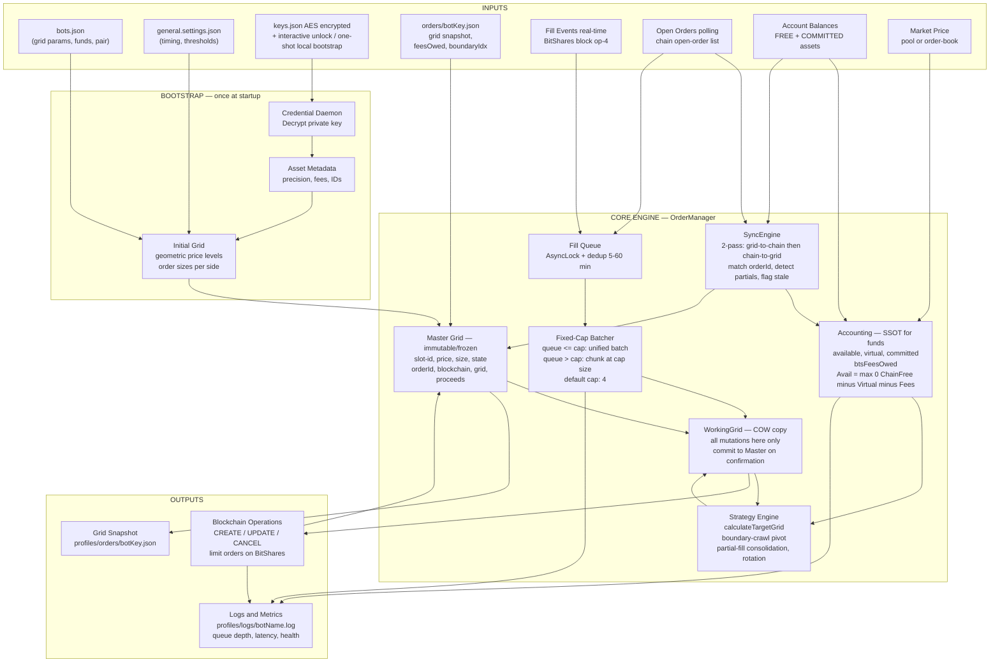

### Key Design Principles

| Principle | Mechanism |
|---|---|
| **Immutability** | Master Grid is frozen; all changes go through a disposable WorkingGrid (Copy-on-Write) |
| **Single Source of Truth** | Accounting engine owns all fund data; everything reads from it |
| **Event-driven + Polling** | Fill Events (real-time) and Open-Order polling feed the same queue |
| **Fixed-Cap Batching** | Deterministic batching with hard cap per broadcast (default 4 fills) |
| **Persistence** | Grid snapshot written after every confirmed blockchain commit |

---

## Module Architecture

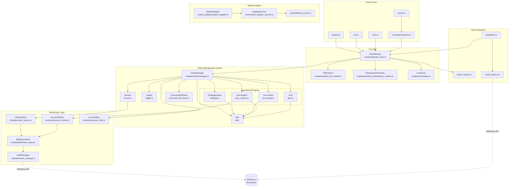

---

## Order Manager: Central Coordinator

The `OrderManager` is the central hub that coordinates all order operations. It delegates specialized tasks to four engine modules:

### Engine Responsibilities

| Engine | File | Responsibility |
|--------|------|----------------|
| **Accountant** | `accounting.ts` | **Single Source of Truth**. Centralized fund tracking via `recalculateFunds()`, fee management, invariant verification, recovery retry state management (`resetRecoveryState()`) |
| **StrategyEngine** | `strategy.ts` | Grid rebalancing, order rotation, partial order handling, fill boundary shifts, remainder tracking |
| **SyncEngine** | `sync_engine.ts` | Blockchain synchronization, fill detection, stale-order cleanup, type-mismatch handling |
| **Grid** | `grid.ts` | Grid creation, sizing, divergence detection, remainder accuracy during capped resize |

---

## Copy-on-Write (COW) Grid Pattern

The OrderManager implements a **Copy-on-Write (COW) pattern** to protect the master grid from speculative modifications until blockchain finality is confirmed.

### Core Principle

The master grid (`this.orders`) is **immutable** - it can only be replaced atomically, never mutated in place. All speculative planning operations work on isolated copies, and the master is only updated when blockchain confirms the operation.

**Important**: Index Sets (`_ordersByState`, `_ordersByType`) are **mutable by design** but must **only be mutated through `_applyOrderUpdate()`**. Direct external mutations violate the COW invariant.

### Protection Mechanisms

| Mechanism | Location | Purpose |
|-----------|----------|---------|
| `Object.freeze()` | `manager.ts:479` | Master Map is frozen at initialization |
| `deepFreeze()` | `manager.ts:979` | Individual order objects are deep-frozen |
| `_gridVersion` | `manager.ts:464` | Version counter for staleness detection |
| `_gridLock` | `manager.ts:455` | AsyncLock serializes grid mutations |
| Encapsulation | `manager.ts:489` | Index Sets are private; mutations only via `_applyOrderUpdate()` |

### Master Grid Update Pattern

All master grid updates follow clone-and-replace semantics:

```javascript
// 1. Clone existing Map
const newMap = cloneMap(this.orders);

// 2. Apply mutation to clone
newMap.set(id, updatedOrder);

// 3. Atomically replace with frozen copy
this.orders = Object.freeze(newMap);
this._gridVersion++;
```

Index Sets follow the same pattern - cloned, mutated, frozen, then replaced.

### WorkingGrid Class

The `WorkingGrid` class (`modules/order/working_grid.ts`) provides isolation for speculative operations:

- **Deep clones** the master grid on construction
- Tracks **modified orders** in a Set
- Supports **staleness detection** via `baseVersion`
- **Never modifies** the master grid

### COW Rebalance Pipeline

```
┌─────────────────────────────────────────────────────────────┐
│  1. Create WorkingGrid from frozen master                   │
│     workingGrid = new WorkingGrid(masterGrid, {baseVersion})│
└─────────────────────────┬───────────────────────────────────┘
                          ↓
┌─────────────────────────────────────────────────────────────┐
│  2. Calculate target state (PURE - no side effects)         │
│     strategy.calculateTargetGrid() returns new Map          │
└─────────────────────────┬───────────────────────────────────┘
                          ↓
┌─────────────────────────────────────────────────────────────┐
│  3. Project target onto working grid                        │
│     Modifies working copy only                              │
└─────────────────────────┬───────────────────────────────────┘
                          ↓
┌─────────────────────────────────────────────────────────────┐
│  4. Validate funds & check staleness                        │
│     If stale: abort without committing                      │
└─────────────────────────┬───────────────────────────────────┘
                          ↓
┌─────────────────────────────────────────────────────────────┐
│  5. Submit to blockchain & wait for finality                │
│     synchronizeWithChain() confirms on-chain                │
└─────────────────────────┬───────────────────────────────────┘
                          ↓
┌─────────────────────────────────────────────────────────────┐
│  6. Commit: Replace master with working grid                │
│     this.orders = Object.freeze(workingGrid.toMap())        │
└─────────────────────────────────────────────────────────────┘
```

### Triggers for Master Grid Updates

Only blockchain-confirmed events trigger master updates:

| Event | Entry Point | Mechanism |
|-------|-------------|-----------|
| Order Created | `sync_engine.ts:858+` | `synchronizeWithChain('createOrder')` |
| Order Cancelled | `sync_engine.ts:858+` | `synchronizeWithChain('cancelOrder')` |
| Order Filled | `sync_engine.ts:syncFromFillHistory()` | `syncFromFillHistory()` |
| Full Sync | `sync_engine.ts:syncFromOpenOrders()` | `syncFromOpenOrders()` |
| Grid Init/Load | `grid.ts:createOrderGrid()` | Bootstrap operations |

### Defensive Measures

1. **Double-check commit pattern**: Staleness is checked both outside and inside the lock
2. **Working grid sync**: If master mutates during planning, working grid is marked stale
3. **Version mismatch detection**: Commits abort if `baseVersion` doesn't match `_gridVersion`

---

## Fill Processing Pipeline

The fill pipeline handles incoming filled orders efficiently through fixed-cap batching instead of one-at-a-time processing.

### Architecture Diagram

```
┌─────────────────────────────────────────────────────────────┐
│                    Fill Event (Blockchain)                   │
│                  (Order filled at price X)                   │
└─────────────────────┬───────────────────────────────────────┘
                      ↓
┌─────────────────────────────────────────────────────────────┐
│              _incomingFillQueue (FIFO Queue)                 │
│          (Accumulates fills from blockchain)                 │
│  Queue: [fill1, fill2, fill3, fill4, fill5, ...]           │
└─────────────────────┬───────────────────────────────────────┘
                      ↓
┌─────────────────────────────────────────────────────────────┐
│         processFilledOrders() - Entry Point                  │
│  Use MAX_FILL_BATCH_SIZE cap for deterministic batching      │
│  Rules: <=cap unified, >cap chunked at cap size             │
└─────────────────────┬───────────────────────────────────────┘
                      ↓
┌─────────────────────────────────────────────────────────────┐
│         Pop Batch (up to MAX_FILL_BATCH_SIZE)               │
│    Takes N fills from queue head (N = 1-4)                  │
│  Example: pops [fill1, fill2, fill3] for batch processing  │
└─────────────────────┬───────────────────────────────────────┘
                      ↓
┌─────────────────────────────────────────────────────────────┐
│     processFillAccounting() - Single Call                    │
│  All fills credited to chainFree in ONE operation           │
│  chainFree += proceeds[fill1] + proceeds[fill2] + ...      │
│  Proceeds immediately available (same rebalance cycle)     │
└─────────────────────┬───────────────────────────────────────┘
                      ↓
┌─────────────────────────────────────────────────────────────┐
│    rebalanceSideRobust() - Single Call                       │
│  Size replacement orders using combined proceeds           │
│  Apply rotations and boundary shifts                       │
│  Use unallocated remainder for next allocation opportunities│
└─────────────────────┬───────────────────────────────────────┘
                      ↓
┌─────────────────────────────────────────────────────────────┐
│   updateOrdersOnChainBatch() - Single Broadcast            │
│  All new orders + cancellations in single operation        │
│  Result: Atomic state update on blockchain                 │
└─────────────────────┬───────────────────────────────────────┘
                      ↓
┌─────────────────────────────────────────────────────────────┐
│              persistGrid()                                   │
│         Save grid state to disk/storage                     │
└─────────────────────┬───────────────────────────────────────┘
                      ↓
                  Loop to next batch
                (or idle if queue empty)
```

### Key Properties

- **Fixed-Cap Batch Sizing**: Batch size is deterministic with `MAX_FILL_BATCH_SIZE` (default 4)
  - 1..4 awaiting: single unified batch (one rebalance/broadcast cycle)
  - 5+ awaiting: repeated chunks of 4 (last chunk may be smaller)

- **Single Rebalance Cycle**: All fills in batch processed in ONE rebalance
  - No "split across cycles" delays
  - Combined proceeds immediately available
  - Single cache fund update

- **Recovery Retries**: Periodic retry system replaces one-shot flag
  - Max 5 attempts per episode
  - 60s minimum interval between retries
  - Reset on fill arrival or periodic sync (10 minutes)
  - `resetRecoveryState()` called by Accountant

- **Stale-Cleaned Order Tracking**: Prevents orphan double-credit
  - Batch failure → cleanup stale order IDs
  - Delayed orphan event → check if ID in stale-cleaned map
  - Skip credit if already cleaned
  - TTL pruning (5 minute retention)

### Impact vs. Legacy Sequential Processing

Scenario source: 29-fill burst during the Feb 7 market crash, modeled at
roughly 3 seconds per broadcast; see
[`FUND_MOVEMENT_AND_ACCOUNTING.md`](FUND_MOVEMENT_AND_ACCOUNTING.md#14-fill-batch-processing--cache-fund-timeline).

| Metric | Legacy (1-at-a-time) | Fixed-Cap Batching | Improvement |
|--------|---------------------|-------------------|-------------|
| **29 Fills** | ~90 seconds | ~24 seconds | **73% faster** |
| **Market Divergence** | High (90s window) | Low (24s window) | **Safer** |
| **Stale Orders** | Frequent | Rare | **More reliable** |
| **Recovery** | One-shot (brick) | Periodic (self-heal) | **Production-ready** |

---

## Fund-Driven Boundary Sync

The grid boundary (which separates BUY, SPREAD, and SELL zones) automatically aligns with the bot's actual inventory distribution.

### Why This Matters

By default, the grid is centered around `startPrice`. However, if the bot has asymmetric capital (e.g., more assetB than assetA), the boundary should shift to favor the "heavier" side.

**Example**: If 70% of capital is in assetB (buying power), the BUY zone should be expanded.

### Boundary Calculation

**Location**: `modules/dexbot_class.ts::_performGridChecks()` → Boundary Sync step

**Algorithm**:
```javascript
// 1. Scan all grid slots and their current assignments
const buyTotal = sum(orders with type === BUY);
const sellTotal = sum(orders with type === SELL);
const totalAllocated = buyTotal + sellTotal;

// 2. Calculate target allocation based on available funds
const buyAvailable = manager.funds.available.buy;
const sellAvailable = manager.funds.available.sell;
const totalAvailable = buyAvailable + sellAvailable;

// 3. Determine ideal boundary position
const buyTargetRatio = buyAvailable / totalAvailable;  // e.g., 0.7
const slots = grid.length;
const targetBuySlots = Math.round(slots * buyTargetRatio * 0.5);  // Apply centering factor

// 4. Adjust boundary to new position
newBoundaryIdx = calculateNewBoundary(targetBuySlots);

// 5. Re-assign slot roles (BUY/SPREAD/SELL) based on new boundary
reassignSlotRoles(newBoundaryIdx);
```

### Three Rotation Cases

Once the new boundary is determined, existing on-chain orders are matched to desired slots:

| Case | Condition | Action |
|------|-----------|--------|
| **MATCH** | Existing order price matches desired slot | Update size if needed |
| **ACTIVATE** | Desired slot is empty | Place new order at this price |
| **DEACTIVATE** | Existing order exceeds target count | Cancel excess orders |

**Target Count**: `activeOrders` from config, applied uniformly to both sides.

### Impact

- **Automatic Capital Repositioning**: Grid follows capital distribution without manual intervention
- **Fund Respect**: Never exceeds available funds when activating slots
- **Smooth Transitions**: Rotations happen gradually, not all at once

---

## Spread Correction (Fund-Aware Approach)

Simplified spread maintenance that keeps the gap consistent and fund-driven, avoiding complex split/merge mechanics.

### The Approach

Instead of complex partial handling, spread corrections are **conservative and fund-safe**:
- Target spread width stays **constant** at `targetSpreadPercent`
- Corrections scale with **actual available funds**, not arbitrary slot budgets
- No dynamic spread inflation based on partial consolidation flags
- Edge-first surplus selection ensures stable rotation candidates

### Algorithm

**Location**: `modules/order/strategy.ts::rebalanceSideRobust()`

The simplified approach prioritizes fund availability over aggressive corrections:

```
1. Detect that spread is wider than targetSpreadPercent
2. Calculate how many edge slots are missing
3. Attempt to place new edge orders with available funds
4. If insufficient funds for all edges:
   - Create what's affordable with available funds
   - Log shortfall (smooth over next rebalance cycle)
5. If a dust partial exists in the correction window:
   - Mark for consolidation in next grid rebuild
   - Don't create complex merge/split side effects
6. Maintain constant target spread—no inflation based on partial flags
```

### Fund-Safe Constraints

Spread corrections respect these hard limits:

```javascript
// In modules/constants.ts
SPREAD_LIMITS: {
    MIN_SPREAD_ORDERS: 2,           // Always maintain minimum gap
    TARGET_SPREAD_PERCENT: (user-configured),  // Fixed width, no inflation
    MAX_REPLACEMENT_SLOTS: 5,       // Conservative correction cap
}

// Each correction order must be healthy
const minHealthySize = calculateMinOrderSize(side);
const affordableOrderCount = Math.floor(availableFunds / minHealthySize);
const correctionOrders = Math.min(missingSlots, affordableOrderCount);
```

**Benefits**:
- ✅ No "double-dust" fragmentation
- ✅ Constant, predictable spread width
- ✅ Funds always respected (no forced allocation)
- ✅ Natural smoothing over multiple rebalance cycles

---

## Periodic Market Price Refresh

Background market price updates every 4 hours to ensure grid anchoring remains accurate during long-running sessions without fills.

### Purpose

If the bot hasn't seen fills for 4 hours, the `startPrice` might become stale if:
- Market has drifted significantly
- Liquidity pool price has shifted
- User wants grid recalculation

### Configuration

**Location**: `modules/constants.ts`

```javascript
BLOCKCHAIN_FETCH_INTERVAL_MIN: 240,  // 4 hours = 240 minutes
```

### Implementation Flow

```javascript
// 1. Timer started during bot initialization
this.periodicRefreshTimer = setInterval(
    () => this._performPeriodicRefresh(),
    BLOCKCHAIN_FETCH_INTERVAL_MIN * 60 * 1000
);

// 2. When timer fires:
async _performPeriodicRefresh() {
    // Fetch latest market price
    const latestPrice = await derivePrice('book');  // Or 'pool'

    // Update internal anchor if using dynamic pricing
    if (config.startPrice === 'book' || config.startPrice === 'pool') {
        this.manager.startPrice = latestPrice;
    }

    // Grid remains un-affected (fund-driven during normal ops)
    // Only used for valuation calculations and divergence checks
}
```

### When `startPrice` is Numeric

If user set `startPrice: 105.5` in bots.json:
- **No auto-refresh**: Numeric value is treated as fixed anchor
- **Valuation uses fixed value**: All calculations use 105.5
- **Grid doesn't move**: Orders stay where they are (fund-driven rebalancing only)

### Non-Disruptive Updates

Price refresh is passive:
- ✅ Updates internal valuation
- ✅ Affects future grid resets if triggered
- ❌ Does NOT move orders on blockchain (no funds wasted on unnecessary rotations)

---

## Out-of-Spread Metric Refinement

Refactored `outOfSpread` from a simple boolean flag to a numeric distance metric for more precise structural updates.

### Before (Boolean)

```javascript
// Old approach
mgr.outOfSpread = true;  // Binary: either in or out
if (mgr.outOfSpread) {
    // Perform spread correction
}
```

**Problem**: Doesn't distinguish between "slightly out" vs "severely out"

### After (Numeric Distance)

```javascript
// New approach: distance in steps
mgr.outOfSpread = 3;  // 3 steps beyond target spread

// Use distance in correction logic
const spreadDistance = mgr.outOfSpread;
const replacementSlots = Math.min(spreadDistance, MAX_CORRECTION_SLOTS);
```

**Benefit**: Enables scaled corrections based on actual severity.

### Calculation

```javascript
// Calculate how many steps beyond target
const currentSpreadSteps = calculateCurrentSpreadGap();
const targetSpreadSteps = calculateTargetSpread();
const outOfSpreadDistance = Math.max(0, currentSpreadSteps - targetSpreadSteps);

mgr.outOfSpread = outOfSpreadDistance;  // 0 = in spread, 3+ = out
```

---

## Pipeline Safety & Diagnostics

The bot includes a comprehensive pipeline monitoring system to prevent indefinite blocking and enable operational visibility.

### Pipeline Timeout Safeguard

**Problem**: Pipeline checks could block indefinitely if operations hung due to network issues or stuck corrections.

**Solution**: 5-minute timeout with automatic, non-destructive recovery.

**Configuration** (modules/constants.ts):
```javascript
PIPELINE_TIMING: {
    TIMEOUT_MS: 300000,  // 5 minutes
}
```

**How It Works**:
- `isPipelineEmpty()` tracks when pipeline operations started blocking via `_pipelineBlockedSince` timestamp
- If blockage exceeds 5 minutes, `clearStalePipelineOperations()` is called
- Non-destructive recovery: clears operation flags only, does NOT delete orders or modify grid state
- Recovery called from `_executeMaintenanceLogic()` during periodic maintenance checks

**Location**: `modules/order/manager.ts` lines 1083-1148

**How It Works**:
- `isPipelineEmpty()` tracks when pipeline operations started blocking via `_pipelineBlockedSince` timestamp
- If blockage exceeds 5 minutes, `clearStalePipelineOperations()` is called
- Non-destructive recovery: clears operation flags only, does NOT delete orders or modify grid state
- Recovery called from `_executeMaintenanceLogic()` during periodic maintenance checks

**Location**: `modules/order/manager.ts` lines 1149+

### Data Flow

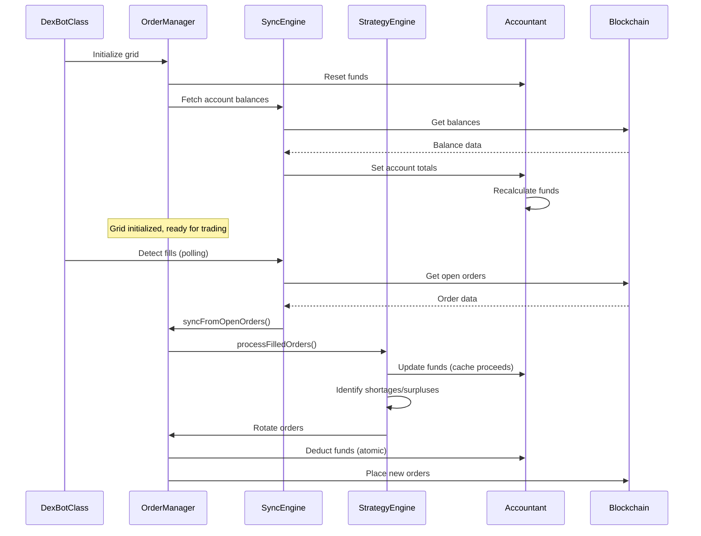

---

## Order State Machine

Orders transition through three primary **states** during their lifecycle. **SPREAD** is an *order type* (like BUY or SELL), not a state — spread-zone slots always carry `state: VIRTUAL`.

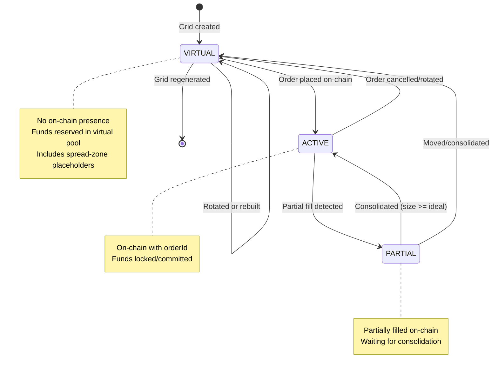

### State Transition Rules

| From State | To State | Trigger | Fund Impact |
|------------|----------|---------|-------------|
| VIRTUAL | ACTIVE | Order placed | Deduct from `chainFree` |
| ACTIVE | PARTIAL | Partial fill | Reduce `committed` by filled amount |
| ACTIVE | VIRTUAL | Order cancelled | Add back to `chainFree` |
| PARTIAL | ACTIVE | Consolidation | Update to `idealSize` (consumes available funds) |
| PARTIAL | VIRTUAL | Order moved | Release funds, re-reserve |

### Critical: Phantom Order Prevention

A **phantom order** is an illegal state where an order exists as ACTIVE/PARTIAL without a corresponding blockchain `orderId`. This corrupts fund tracking and causes "doubled funds" warnings.

**Why Phantoms Occur**:
1. **Grid Resize Bug**: `Grid._updateOrdersForSide()` could force VIRTUAL → ACTIVE without blockchain confirmation
2. **Sync Gap**: Orders without orderId could remain ACTIVE indefinitely if sync logic skipped them
3. **No Validation**: No centralized check prevented invalid state assignments

**Prevention System** (Three-Layer Defense):

| Layer | Location | Mechanism |
|-------|----------|-----------|
| **Guard** | `manager.ts:570-584` | Centralized validation in `_updateOrder()` rejects ACTIVE/PARTIAL without orderId, auto-downgrades to VIRTUAL |
| **Grid Protection** | `grid.ts:1154` | Preserve order state during resize: `state: order.state` instead of forcing ACTIVE |
| **Sync Cleanup** | `sync_engine.ts:297-305` | Detect orders without orderId and convert to SPREAD placeholders; prevent phantom fills from triggering rebalancing |

**Verification**:
- Direct state assignment in code review: All transitions go through `_updateOrder()` (cannot bypass)
- Automated tests: `tests/repro_phantom_orders.ts` confirms all prevention layers work
- Logging: Any phantom creation attempt is logged as ERROR with context

---

## Fund Flow Architecture

The fund tracking system uses atomic operations to prevent race conditions and overdrafts.

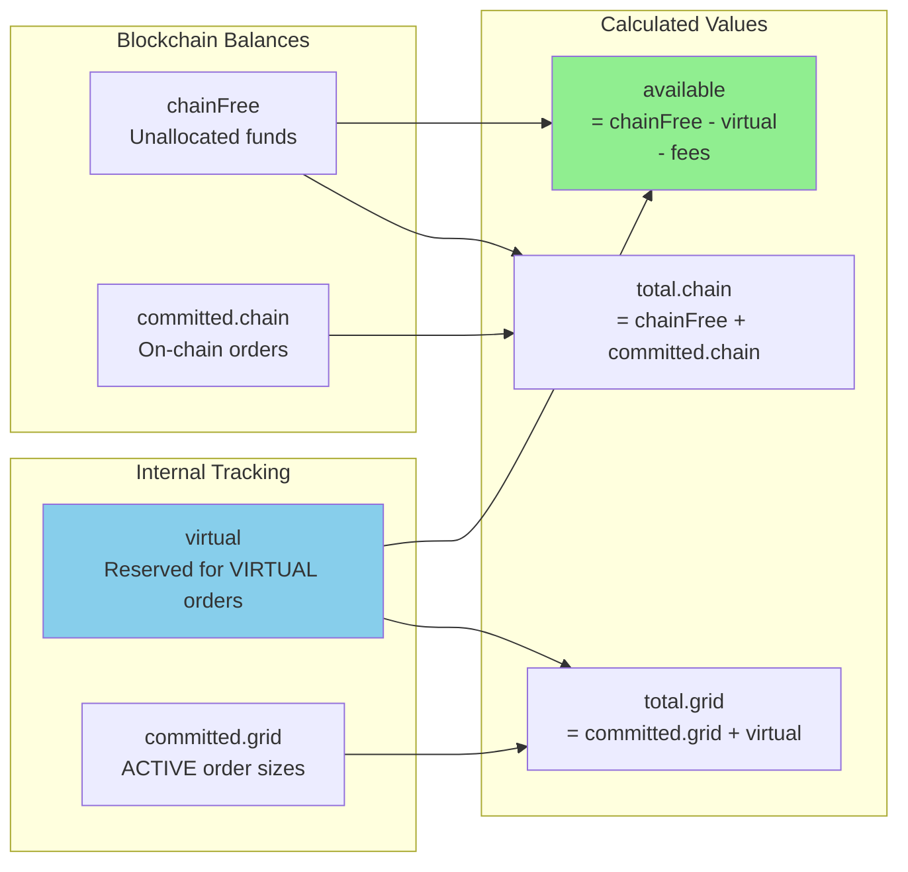

### Fund Components Explained

- **chainFree**: Unallocated funds on blockchain (from `accountTotals.buyFree/sellFree`)
- **committed.chain**: Funds locked in on-chain orders (ACTIVE orders with `orderId`)
- **committed.grid**: Internal tracking of ACTIVE order sizes
- **virtual**: Funds reserved for VIRTUAL orders (not yet on-chain)
- **available**: Free funds for new orders = `max(0, chainFree - virtual - fees)`

### Atomic Fund Operations

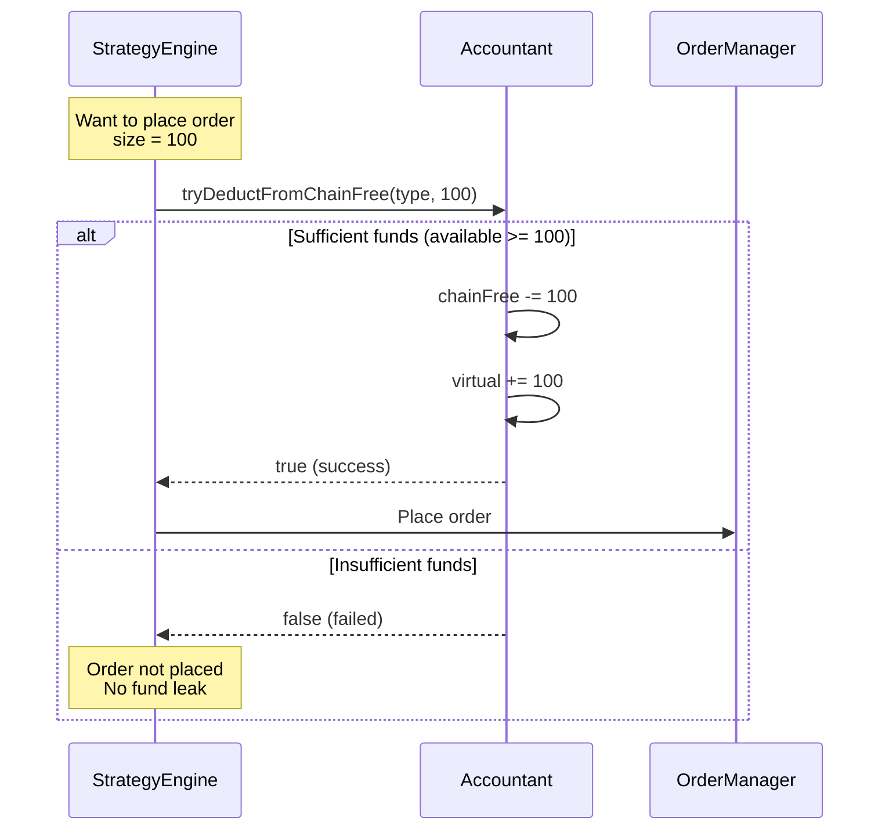

---

## Grid Topology

The grid uses a unified "Master Rail" with a dynamic boundary that shifts as fills occur.

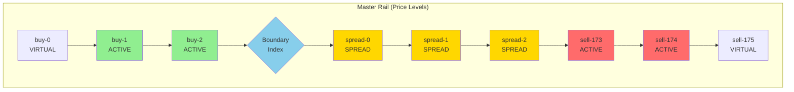

### Boundary Movement

- **Buy Fill**: `boundaryIdx -= 1` (shift left/down)
- **Sell Fill**: `boundaryIdx += 1` (shift right/up)

### Role Assignment

- **BUY**: Slots `[0, boundaryIdx]`
- **SPREAD**: Slots `[boundaryIdx + 1, boundaryIdx + G]` where G = spread gap size (empty slots). Actual gaps = G + 1.
- **SELL**: Slots `[boundaryIdx + G + 1, N]`

---

## Key Operations

### 1. Fill Processing Flow

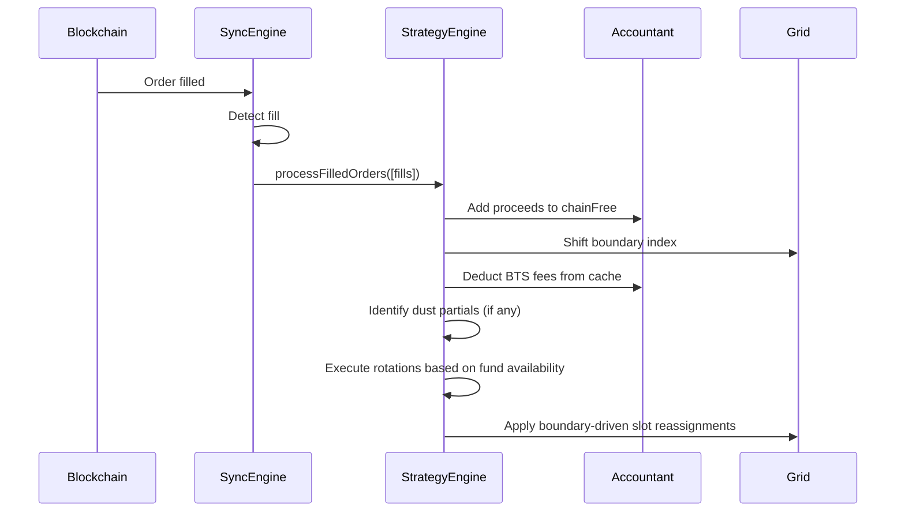

### 2. Order Rotation (Crawl Mechanism)

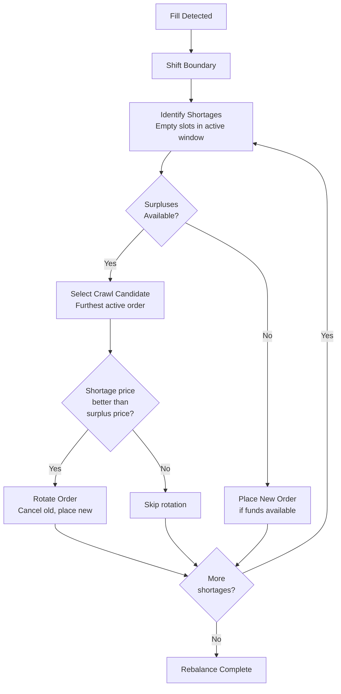

### 3. Grid Divergence Detection

The grid divergence system monitors and corrects misalignment between ideal grid state and persistent blockchain state.

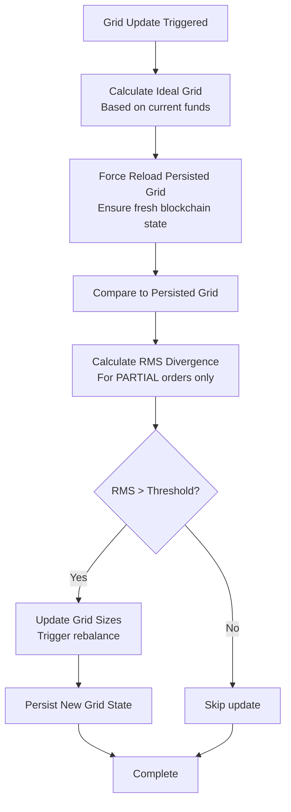

**Key Improvement (v0.7)**: Force reload mechanism now ensures fresh persisted grid data before comparison, preventing stale cache from causing false divergence detections.

---

## Concurrency & Locking

The system uses order-level locks to prevent race conditions during async operations.

### Lock Mechanism

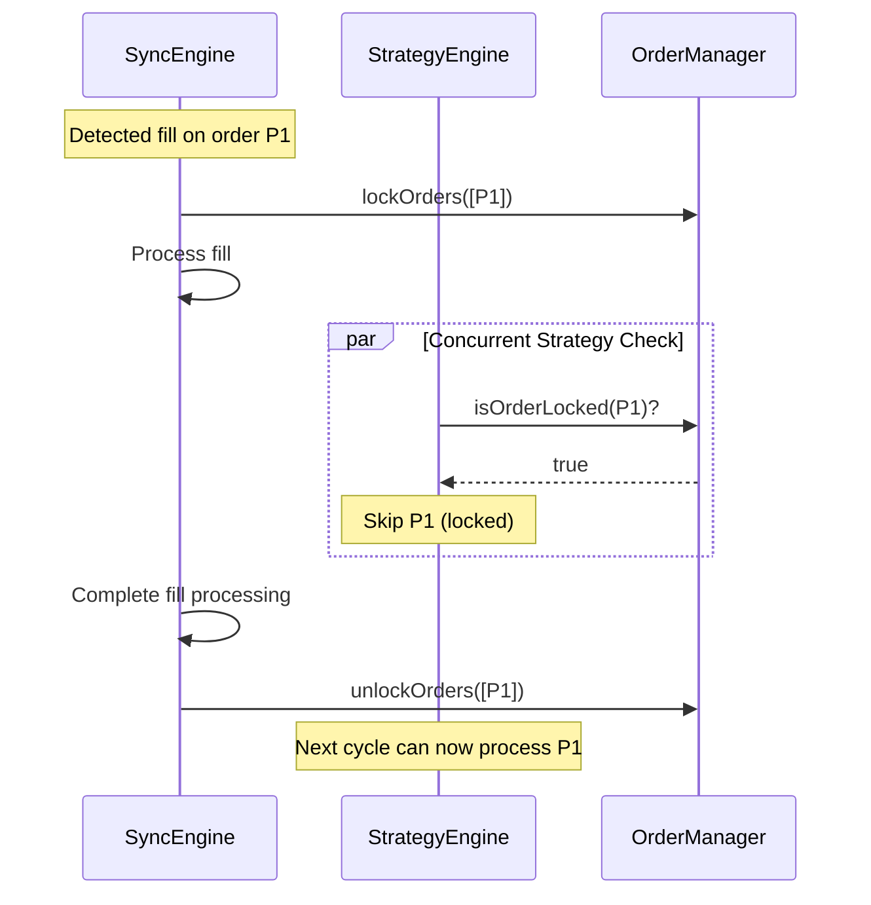

### Lock Lifetime

- **Default timeout**: 5-10 seconds
- **Auto-expiry**: Prevents deadlocks from crashes
- **Best practice**: Always use try/finally to ensure unlock

---

## Module Responsibilities Summary

| Module | Primary Responsibility | Key Functions |
|--------|----------------------|---------------|
| **OrderManager** | Central coordinator, state management | `_updateOrder()`, `lockOrders()`, `getOrdersByTypeAndState()` |
| **Accountant** | Fund tracking, fee management | `recalculateFunds()`, `tryDeductFromChainFree()`, `_verifyFundInvariants()` |
| **StrategyEngine** | Rebalancing, rotation, partial handling | `rebalance()`, `processFilledOrders()`, `preparePartialOrderMove()` |
| **SyncEngine** | Blockchain sync, fill detection | `syncFromOpenOrders()`, `synchronizeWithChain()` |
| **Grid** | Grid creation, sizing, divergence | `createOrderGrid()`, `compareGrids()`, `checkAndUpdateGridIfNeeded()` |
| **Utils** | Shared utilities, conversions | `quantizeFloat()`, `normalizeInt()` (`math.ts`); order predicates (`order.ts`); COW action building (`validate.ts`); price derivation (`system.ts`) |
| **Logger** | Formatted logging, diagnostics | `logOrderGrid()`, `logFundsStatus()`, `logGridDiagnostics()` |

---

## Dynamic Configuration Refresh

The bot implementation supports runtime updates to specific configuration parameters without requiring a process restart. This is handled via a **Periodic Configuration Refresh** mechanism.

### The Refresh Cycle

Every 4 hours (default `BLOCKCHAIN_FETCH_INTERVAL_MIN`), the bot performs the following safe refresh cycle:

1.  **Thread-Safe Load**: The bot re-reads `profiles/bots.json` using `readBotsFileWithLock` to ensure it doesn't collide with manual edits or the CLI manager.
2.  **Memory Update**: It identifies its own configuration entry and updates its internal memory state (`this.config` and `manager.config`).
3.  **Non-Disruptive Application**: The refresh is designed to be **passive**. It updates valuation anchors but does **not** trigger on-chain order movement automatically.

### Configuration Authority: `startPrice`

The `startPrice` parameter follows a strict hierarchy of authority:

| Setting Type | Source | Behavior |
|--------------|--------|----------|
| **Numeric** | `bots.json` | **Single Source of Truth**. Blocks all auto-derivation. Used as a fixed anchor for valuation and grid resets. |
| **"pool"** | Blockchain | Derived from current Liquidity Pool price during resets or 4h refresh cycles. |
| **"book"** | Blockchain | Derived from current order book price during resets or 4h refresh cycles. |

---

## Data Persistence

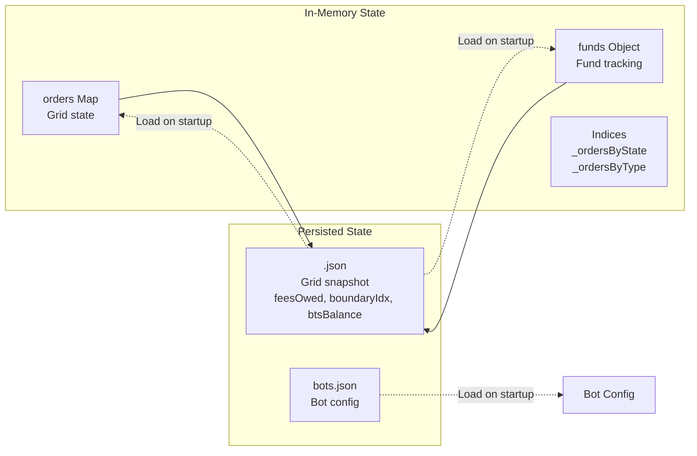

### Persistence Strategy

- **Grid state**: Persisted after every rebalance to `<botKey>.json` in `profiles/orders/`
- **Fund state**: Available funds derived from blockchain balances at runtime (no separate persistence needed)
- **Retry logic**: 3 attempts with exponential backoff
- **Graceful degradation**: Bot continues if persistence fails (in-memory only)

---

## Memory-Only Integer Tracking

The system has been optimized to use a "memory-driven" model for order updates, eliminating redundant blockchain API calls during normal operation.

### Key Changes

**1. Raw Order Cache (`rawOnChain`)**
- Grid slots now store exact blockchain order representations (integers/satoshis) in a `rawOnChain` cache
- **Birth**: Cache populated immediately after successful order placement using broadcasted arguments
- **Partial Fills**: Cache updated in-place via integer subtraction (subtracting filled satoshis from `for_sale`)
- **Updates/Rotations**: Cache refreshed with adjusted integers returned by build process

**2. Eliminated Redundant API Calls**
- Removed all `readOpenOrders()` calls from `_buildSizeUpdateOps()` and `_buildRotationOps()`
- Removed `computeVirtualOpenOrders()` logic that was redundantly fetching entire account state
- The bot now trusts its internal state, backed by real-time fill listener, to build transactions

**3. Refactored `buildUpdateOrderOp()`**
- Updated to support optional `cachedOrder` parameter
- Allows callers to bypass blockchain queries if they have raw state in memory
- Returns `finalInts` along with operation data for local tracking

**4. Self-Healing Resilience**
- Maintains "State Recovery Sync" fallback
- If a memory-driven transaction fails, bot catches error and performs a full refresh
- Ensures internal ledger stays synchronized with BitShares blockchain

### Benefits
- **Faster reaction time**: No waiting for blockchain queries during order updates
- **Reduced API load**: Fewer fetches, less network congestion
- **Mathematical precision**: Integer-based tracking prevents float precision errors
  - *See [FUND_MOVEMENT_AND_ACCOUNTING.md § 5.5](FUND_MOVEMENT_AND_ACCOUNTING.md#55-precision--quantization-patch-14) for quantization utilities and best practices*
- **Fallback safety**: Automatic recovery if memory state becomes inconsistent

### Performance Impact
- Batch operations (size updates, rotations) now run without any blockchain fetches
- Only placement operations and recovery syncs query the blockchain
- Estimated **10-20x speedup** for high-frequency operations

---

## Error Handling & Safety

### Fund Invariants

The system continuously monitors three mathematical invariants:

1. **Account Equality**: `chainTotal = chainFree + committed.chain`
2. **Committed Ceiling**: `committed.grid <= chainTotal`
3. **Available Leak Check**: `available <= chainFree`

**Tolerance**: 0.1% (to account for fees and rounding)

### Index Consistency

- **Validation**: `validateIndices()` checks Map ↔ Set consistency
- **Repair**: `_repairIndices()` rebuilds indices if corruption detected
- **Defensive**: Called after critical operations

---

## Performance Considerations

### Optimization Strategies

1. **Batch fund recalculation**: `pauseFundRecalc()` / `resumeFundRecalc()`
2. **Index-based lookups**: O(1) access via `_ordersByState` and `_ordersByType`
3. **Lock expiry**: Prevents permanent blocking from crashes
4. **Fee caching**: Reduces blockchain API calls

### Metrics Tracking

```javascript
manager.getMetrics()
// Returns:
// - fundRecalcCount
// - invariantViolations
// - lockAcquisitions
// - stateTransitions
// - lastSyncDurationMs
```

---

### Zero-Dependency Policy

DEXBot2 operates under a **zero mandatory production dependency** policy. The only declared dependency (`ws`) is **optional** — the bot works without it (falling back to built-in Node.js HTTP). Every production capability — blockchain client, crypto/signing, serialization, testing, price feeds, credential vault — is implemented natively within the codebase.

**Why:** Trading bots handle real money. Every external dependency is a supply-chain risk surface. Keeping the dependency tree empty means no `npm audit` surprises, no supply-chain attacks on upstream packages, and no version-migration overhead for the core runtime.

**Special case — trading bots:** This level of dependency discipline is rare in open-source trading software. Established projects (Gekko, Freqtrade, Hummingbot) carry 15–20+ production dependencies. DEXBot2's empty dependency tree is a deliberate architectural choice, not an accidental outcome — it reflects the project's priority of operational safety over developer convenience.

**What this means in practice:**
- Blockchain connectivity (`bitshares-native/`) — hand-rolled from protocol primitives
- Elliptic curve crypto (secp256k1) — native JS, zero native addons
- Testing — `node:assert`, no Jest/Mocha/Vitest
- Persistence — JSON flat files, no SQLite/ORM
- Price sources — native candle fetching, no CCXT/CoinGecko
- Process management — PM2 ecosystem or direct Node.js, no Docker requirement

### Testing Strategy & Quality Assurance

DEXBot2 uses a native Node.js `assert` testing strategy to ensure reliability without heavy dependencies.

### Test Coverage by Module

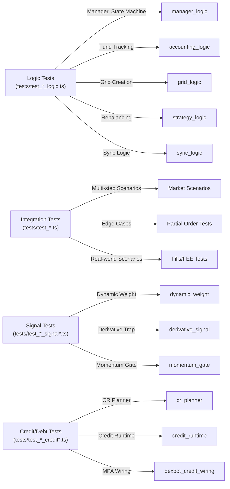

### Running Tests

```bash
# Run all tests (native assert)
npm test

# Specific logic area
tsx tests/test_accounting_logic.ts

# Signal tests
tsx tests/test_market_adapter_signal_gates.ts
tsx tests/test_dynamic_weight_override_wiring.ts

# Credit/debt tests
tsx tests/test_cr_planner.ts
tsx tests/test_dexbot_credit_wiring.ts
```

### Test Quality Metrics

**Coverage Goals:**
- ✅ All public methods have tests
- ✅ All invariants verified automatically
- ✅ Edge cases covered (zero funds, max orders, etc.)
- ✅ Concurrent operations tested with locks
- ✅ State transitions validated end-to-end
- ✅ Signal pipelines tested (dynamic weight, derivative traps)
- ✅ Credit/debt runtime tested (CR planner, MPA wiring)

**Recent Improvements (2026-03-01):**
- Added 50+ new test cases for signal intelligence and credit runtime
- Created dynamic weight override and market adapter signal gate tests
- Added derivative momentum gate and signal trap regression tests
- Enhanced credit/debt tests with CR planner and MPA wiring validation

### Testing Best Practices

**For Developers:**

1. **Run tests before commits**
   ```bash
   npm test
   ```

2. **Add tests for new features**
   - Follow patterns in existing tests
   - Test fund impact of new logic
   - Include edge cases

3. **Verify invariants**
   ```javascript
   expect(manager.validateIndices()).toBe(true);
   expect(chainTotal === chainFree + chainCommitted).toBe(true);
   ```

4. **Use debug mode for problematic scenarios**
   ```javascript
   manager.logger.level = 'debug';  // Enable detailed logging
   // ... run scenario ...
   // Check console output for detailed fund tracking
   ```

### Test Documentation References

- **[TEST_UPDATES_SUMMARY.md](../tests/TEST_UPDATES_SUMMARY.md)** - Detailed test coverage for recent test cases
  - Maps each test to specific bugfixes
  - Shows what each test validates
  - Running instructions for specific areas

- **[developer_guide.md#testing-fund-calculations](developer_guide.md#testing-fund-calculations)** - Testing guide for developers
  - How to write fund tests
  - Common test patterns
  - Debugging failing tests
  - Adding tests for new features

---

## Market Adapter Signal Pipeline

The market adapter runs as a standalone process that computes AMA-derived grid prices, trend signals, dynamic weights, and collateral-ratio advisories.

### Signal Flow

```
price_candles -> AMA -> gridCenterPrice
                |
                +-> slope_analysis -> trend_offset (asymmetric weight shift)
                |
price_candles -> ATR -> weight_variance (symmetric shift)
                |
                +-> regime_detection (Hurst/PE) -> regime_filter
                |
                +-> Kalman_confirmation -> blended_dynamic_weight
```

### Outputs (per cycle, per bot)
- `gridCenterPrice` — AMA center price, clamped to min/max bounds
- `weights` — `{ buy, sell }` dynamic grid weighting
- `collateralRecommendation` — advisory collateral ratio hint
- `trend` / `atr` — raw regime and volatility signals
- Trigger files when the adapter accepts the first AMA center, the grid price delta exceeds threshold, or whitelisted range-scaling slope delta exceeds threshold

### Integration with Bot Runtime

1. Adapter persists `profiles/orders/<botKey>.dynamicgrid.tson` before any reset trigger.
2. Adapter writes `profiles/recalculate.<botKey>.trigger` for bootstrap, AMA-center delta, or whitelisted AMA-slope range reset.
3. `dexbot_maintenance_runtime.ts` consumes the trigger under `_fillProcessingLock`, with idle/dust deferral when needed.
4. Bot runtime reads accepted center, range-scaling fields, and dynamic weights from the dynamic-grid snapshot during reset and selected maintenance paths.

---

## Credential Security Architecture

DEXBot2 uses a hardened credential daemon (`credential-daemon.ts`) for key management and signing.

### Security Layers
- **Vault v2**: scrypt (N=2^17) key derivation, per-record HKDF isolation, AES-256-GCM encryption
- **Daemon-backed signing**: Primary bot flow uses signing tokens; compatibility clients can request raw keys
- **Session cache**: Encrypted HKDF re-encryption with a random salt never persisted
- **Runtime hardening**: lstat + owner/mode/type checks on all sockets and ready files; bootstrap socket destroyed after first use
- **Strict daemon policy**: Memory safety and zeroing, session hardening, signing cache with time-based expiry

### PM2 Integration

`node pm2` unlocks `dexbot-cred` through a one-shot local bootstrap channel instead of exporting the master password to every PM2 app. Use `node pm2 restart ...` for DEXBot-managed PM2 actions.

---

## Credit/Debt Runtime

Native DEXBot2 support for MPA borrowing and credit offer workflows via `modules/credit_runtime.ts`.

### Scope
- **MPA borrowing**: Call-order updates with debt-first CR planning
- **Credit offers**: Accept/repay with auto-reborrow, LP-backed collateral valuation
- **Policy enforcement**: Per-bot `debtPolicy` with hard CR floors/ceilings and max fee rates
- **Grid reset coupling**: Every successful CR adjustment requests a grid rebuild

### Runtime Rules
- Evaluates on the dedicated credit watchdog interval
- No separate enable switch — active when `debtPolicy.lending` is present, non-empty, and every item declares `collateralAsset`
- Claw can read the same bot policy without redefining rules

---

## Recent Improvements

### Grid Rebalancing Robustness

The strategy engine has been significantly strengthened with improvements to fund validation, dust handling, and order constraints:

**1. Pre-Flight Fund Validation**
- Before executing batch order placements, available funds are validated
- Prevents insufficient fund errors during large rotation cycles
- Uses atomic check-and-deduct pattern for safety
- Located in: `modules/order/strategy.ts` - `rebalanceSideRobust()`

**2. Dust Partial Handling**
- Improved dust detection algorithm prevents false positives
- Detects dust as `< 5% of ideal order size`
- Dust partials are absorbed into the next grid rebuild cycle (no merge/split mechanics)
- **Auto-Cancellation**: `_cancelDustOrders()` (called post-fill and in periodic maintenance) cancels dust partials on-chain once they exceed `DUST_CANCEL_DELAY_SEC` seconds in dust state; timer tracked per `orderId` in `_dustSinceMap`. `-1` disables, `0` = instant, default 30s.

**3. Strict Order Size Constraints**
- Orders validated to not exceed available funds
- Maximum order size enforced during both placement and rotation
- Prevents oversized orders that fail on-chain
- Atomic validation with placement ensures consistency

**4. Boundary Index Persistence**
- BoundaryIdx (spread zone pivot) now correctly persisted across bot restarts
- Ensures grid rotation continues seamlessly after divergence correction
- Fixes grid instability from incorrect boundary tracking

**5. Taker Fee Accounting**
- Both market and blockchain taker fees now accounted for correctly
- Fee deduction uses proper `isMaker` parameter
- Prevents fund leaks from missing fee calculations
- Located in: `modules/order/strategy.ts` - `processFilledOrders()`

**6. Precision Spread Management (Logarithmic Logic)**
- **Discrete Step Tracking**: Replaced the legacy linear multiplier (`SPREAD_WIDENING_MULTIPLIER`) with a discrete 1-slot logarithmic buffer. This ensures correction triggers exactly when the market moves by one full increment.
- **Center-Gap Awareness**: Refined the grid initialization math to account for the "Center Gap" naturally created during symmetric centering. This reduces the initial spread by ~0.5% (one full increment) compared to the previous version.
- **Collision-Free Safety**: Increased `MIN_SPREAD_FACTOR` to 2.1 to ensure that the security minimum (2 spread orders) never conflicts with the spread correction threshold, even at micro-spread configurations.

### Related Documentation

For detailed fund calculations and test coverage, see:
- [developer_guide.md#testing-fund-calculations](developer_guide.md#testing-fund-calculations) - How fund calculations are tested
- [TEST_UPDATES_SUMMARY.md](../tests/TEST_UPDATES_SUMMARY.md) - Detailed coverage of recent bugfix tests

---

- [Fund Movement Logic](FUND_MOVEMENT_AND_ACCOUNTING.md) - Detailed mathematical formulas and algorithms
- [Developer Guide](developer_guide.md) - Code navigation and onboarding
- [README](../README.md) - User documentation and setup
- [WORKFLOW.md](WORKFLOW.md) - Git branch workflow

---

## Quick Reference

### Common Code Patterns

**Get orders by state and type:**
```javascript
const activeBuys = manager.getOrdersByTypeAndState(ORDER_TYPES.BUY, ORDER_STATES.ACTIVE);
```

**Atomic fund deduction:**
```javascript
if (manager.accountant.tryDeductFromChainFree(orderType, size)) {
    // Funds deducted, safe to place order
} else {
    // Insufficient funds, skip
}
```

**Batch order updates:**
```javascript
manager.pauseFundRecalc();
for (const order of orders) {
    // context parameter helps with logging/debugging the source of the update
    manager._updateOrder(order, 'batch-update', { skipAccounting: false, fee: 0 });
}
manager.resumeFundRecalc(); // Recalculates once
```

**Lock orders during async operations:**
```javascript
manager.lockOrders([orderId]);
try {
    await asyncOperation();
} finally {
    manager.unlockOrders([orderId]);
}
```
